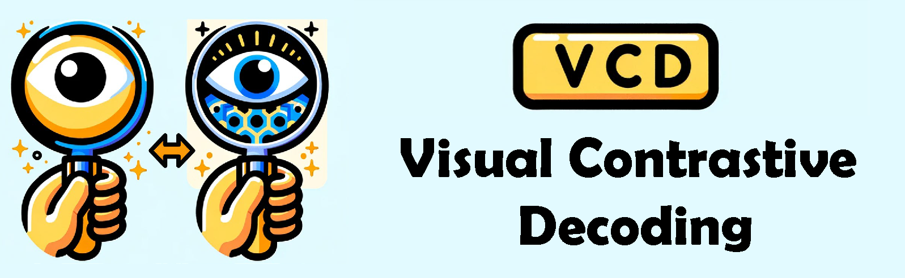
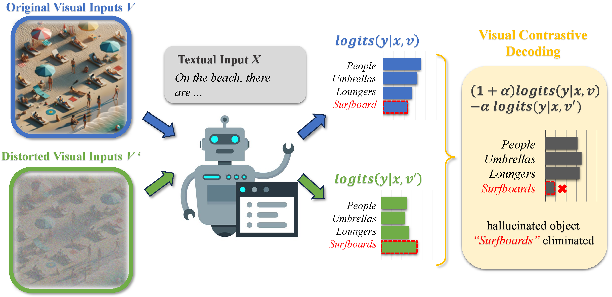
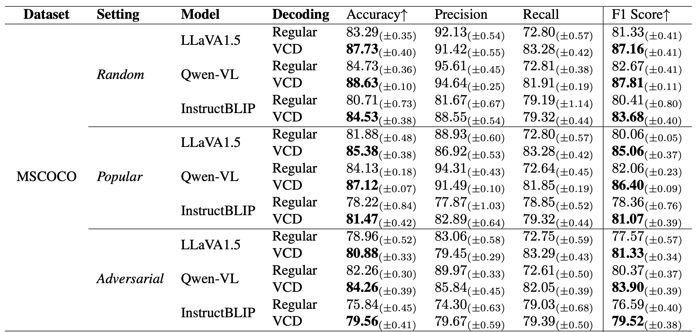
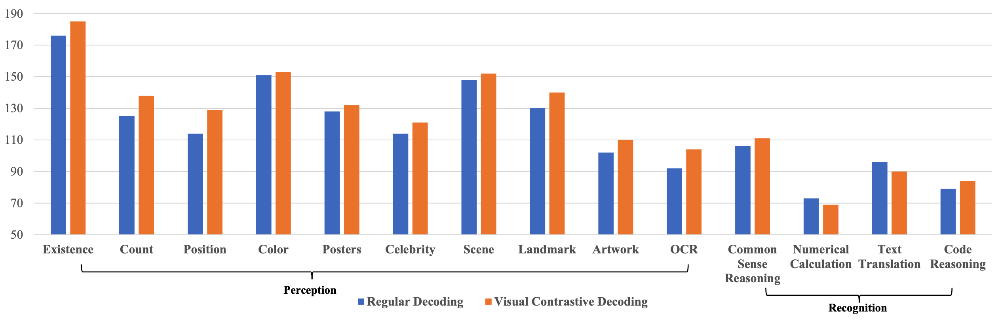
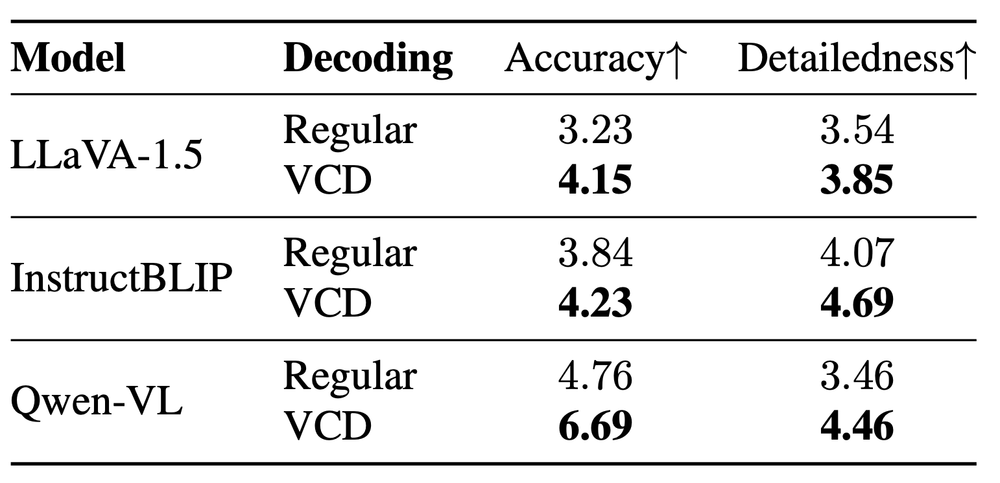
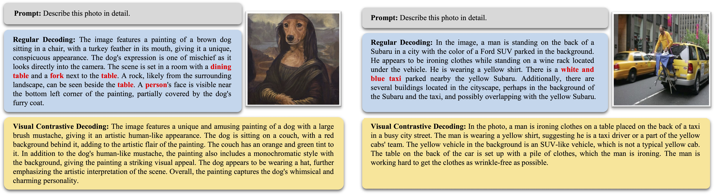
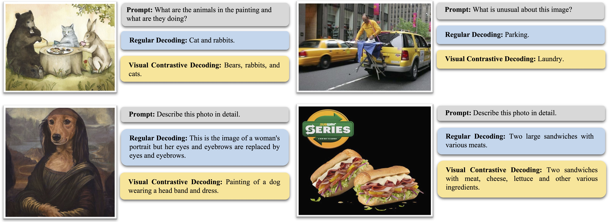
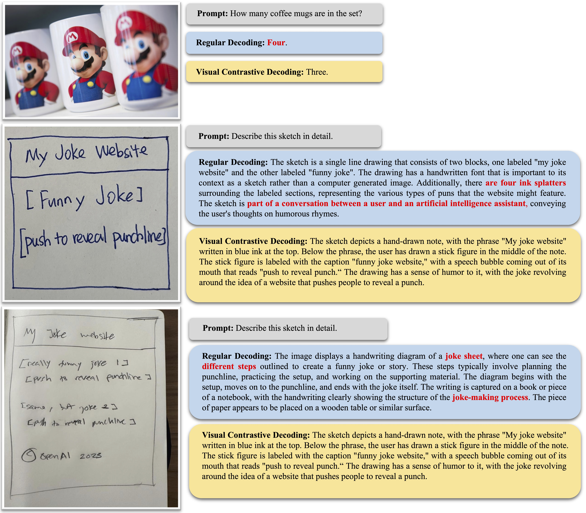

<p align="center" width="100%">
<a target="_blank"></a>
</p>

# VCD: Mitigating Object Hallucinations in Large Vision-Language Models through Visual Contrastive Decoding
<!-- **VCD: Mitigating Object Hallucinations in Large Vision-Language Models through Visual Contrastive Decoding** -->
This is the official repo for Visual Contrastive Decoding, a simple, training-free method for mitigating hallucinations in LVLMs during decoding without utilizing external tools.

<div style='display:flex; gap: 0.25rem; '>
<a href='LICENCE'></a>
<a href='https://arxiv.org/abs/2311.16922'></a>
<a href='https://twitter.com/Leon_L_S_C'></a>
</div>

## 🔥 Update
* [2024-04-05]: ⭐️⭐️⭐️ VCD is selected as Poster Highlight in CVPR 2024! (Top 11.9% in accepted papers)
* [2023-11-29]: ⭐️ Paper of VCD online. Check out [this link](https://arxiv.org/abs/2311.16922) for details.
* [2023-11-28]: 🚀 Codes released.

## 🎯 Overview

- We introduce Visual Contrastive Decoding (VCD), **a simple and training-free** method that contrasts output distributions derived from original and distorted visual inputs.
- The new **contrastive probability distribution** for decoding is formulated as follows:
```math
p_{vcd}(y \mid v, v', x) = softmax[ (1+\alpha)\times logit_\theta (y \mid v, x) - \alpha \times logit_\theta(y \mid v', x)],
```
- The proposed VCD effectively reduces the over-reliance on **statistical bias** and **unimodal priors**, two essential causes of object hallucinations.


## 🕹️ Usage
### Environment Setup
```bash
conda create -yn vcd python=3.9
conda activate vcd
cd VCD
pip install -r requirements.txt
```

### How to Use VCD in LVLMs

The two core function of VCD, adding noise to images and generating text based on VCD sampling, are found in the `vcd_utils` folder. Scripts for using VCD sampling in LLaVA, InstructBLIP, and QwenVL are located in `VCD/eval`. We have annotated some key changes with `## cd_comment` for easy location using ctrl+f.

To help you get started quickly, here's an example using LLaVA on how to replace the conventional sampling method with the VCD method during generation:
1. Add the following at the beginning of the start-up script:
```python
from vcd_utils.vcd_sample import evolve_vcd_sampling
evolve_vcd_sampling()
```
The `evolve_vcd_sampling` function replaces the sampling function in the transformers library. The modified sampling function includes an option for visual contrastive decoding, while keeping the rest unchanged.

2. Slightly modify `llava_llama.py`:

   a. Add contrastive decoding parameters in the `LlavaLlamaForCausalLM` class's `forward` function to avoid exceptions in `model.generate`.
   
   b. Add the `prepare_inputs_for_generation_cd` function.

3. Add noise to the image:
```python
from vcd_utils.vcd_add_noise import add_diffusion_noise
image_tensor_cd = add_diffusion_noise(image_tensor, args.noise_step)
```
set the hyperparameter in the `generate` function:
```python
output_ids = model.generate(
    input_ids,
    images=image_tensor.unsqueeze(0).half().cuda(),
    images_cd=(image_tensor_cd.unsqueeze(0).half().cuda() if image_tensor_cd is not None else None),
    cd_alpha = args.cd_alpha,
    cd_beta = args.cd_beta,
    do_sample=True)
```

## 🏅 Experiments
- **VCD significantly mitigates the object hallucination issue across different LVLM families.**

*table 1(Part of). Results on POPE. Regular decoding denotes direct sampling, whereas VCD refers to sampling from our proposed contrastive distribution pvcd. The best performances within each setting are bolded.*

- **Beyond mitigating object hallucinations, VCD also excels in general LVLM benchmarks, highlighting its wide-ranging applicability.**

*figure 4. MME full set results on LLaVA-1.5. VCD consistently enhances LVLMs’ perception capacities while preserving their recognition competencies.*
<p align="center" width="80%">
<a target="_blank"></a>
</p>

*table 3. Results of GPT-4V-aided evaluation on open-ended generation. Accuracy measures the response’s alignment with the image content, and Detailedness gauges the richness of details in the response. Both metrics are on a scale of 10.*

- **Please refer to [our paper](https://arxiv.org/abs/2311.16922) for detailed experimental results.**


## 📌 Examples

*figure 5. Illustration of hallucination correction by our proposed VCD with two samples from LLaVA-Bench. Hallucinated objects from LVLM's regular decoding are highlighted in red.*


*figure 8. More examples from LLaVA-Bench of our proposed VCD for enhanced general perception and recognition capacities.*


*figure 7. More examples from LLaVA-Bench of our proposed VCD for hallucination corrections. Hallucinated objects from LVLM's regular decoding are highlighted in red.*


## 📑 Citation
If you find our project useful, we hope you can star our repo and cite our paper as follows:
```
@article{damonlpsg2023vcd,
  author = {Sicong Leng, Hang Zhang, Guanzheng Chen, Xin Li, Shijian Lu, Chunyan Miao, Lidong Bing},
  title = {Mitigating Object Hallucinations in Large Vision-Language Models through Visual Contrastive Decoding},
  year = 2023,
  journal = {arXiv preprint arXiv:2311.16922},
  url = {https://arxiv.org/abs/2311.16922}
}
```

## 📝 Related Projects
- [Contrastive Decoding](https://github.com/XiangLi1999/ContrastiveDecoding): Open-ended Text Generation as Optimization
- [InstructBLIP](https://github.com/salesforce/LAVIS/tree/main/projects/instructblip): Towards General-purpose Vision-Language Models with Instruction Tuning
- [Qwen-VL](https://github.com/QwenLM/Qwen-VL): A Versatile Vision-Language Model for Understanding, Localization, Text Reading, and Beyond
- [LLaVA 1.5](https://github.com/haotian-liu/LLaVA): Improved Baselines with Visual Instruction Tuning
